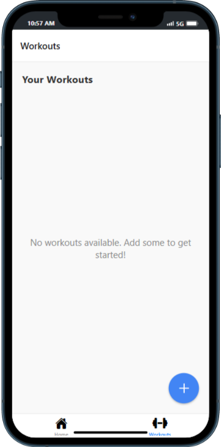

# SmartFit App - A Comprehensive Fitness Tracker

SmartFit is an all-in-one fitness tracking app designed to help users monitor their workouts, track their daily steps, set fitness goals, log meals, view progress over time, and receive personalized notifications. It integrates essential features of React Native, providing a complete learning experience for developers.





## Features

- **Workout Tracking**: Log and track various workouts, including running, weightlifting, yoga, and more.
- **Step Tracking**: Monitor daily step count using device sensors.
- **Goal Setting**: Set fitness goals and track progress toward achieving them.
- **Meal Logging**: Log meals and track nutritional intake to maintain a balanced diet.
- **Progress Visualization**: View graphs and stats to track progress over time.
- **Notifications**: Receive notifications for workouts, meals, and goal reminders.
- **User Profile**: Create a personalized profile to customize your fitness journey.
- **Multi-platform Support**: Designed to work seamlessly on both Android and iOS devices.

## Technologies Used

- **React Native**: For building the cross-platform mobile app.
- **Redux**: For state management across the app.
- **React Navigation**: For navigation between different screens.
- **Expo**: For easy setup and testing of the React Native app.
- **Firebase**: For user authentication and data storage.
- **React Native Sensors**: For tracking daily steps and workout data.
- **React Native Chart Kit**: For visualizing progress and statistics.

## Installation

### Prerequisites

- Node.js (version 14 or above)
- npm or yarn
- Expo CLI (optional but recommended for development)

### Step 1: Clone the repository

```bash
git clone https://github.com/richardbentil/smartfit-app.git
